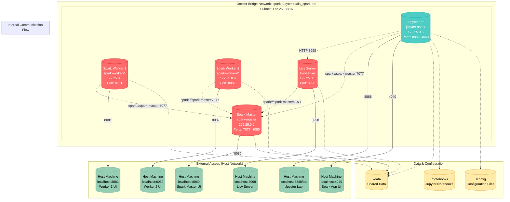

# 🚀 Spark Jupyter Scala Cluster

A complete containerized Apache Spark cluster with Jupyter notebooks, Scala support, and integrated development environment for big data analytics and machine learning.

## 📊 Architecture Overview



 # 🏗️ Technology Stack
 ```bash
 | Component        | Version      | Purpose                             |
| ---------------- | ------------ | ----------------------------------- |
| **Apache Spark** | 3.5.0        | Distributed computing engine        |
| **Hadoop**       | 3.3.4        | Distributed storage (via Spark)     |
| **Jupyter Lab**  | 4.0.7        | Interactive development environment |
| **Python**       | 3.9          | Primary programming language        |
| **Scala**        | 2.12.15      | JVM language support via Almond     |
| **Apache Livy**  | 0.7.1        | REST interface for Spark            |
| **SparkMagic**   | Latest       | Jupyter kernel for Spark            |
| **Almond**       | 0.14.0-RC19  | Scala kernel for Jupyter            |
| **Java**         | 11 (OpenJDK) | JVM runtime                         |
 ```
 
# 🌐 Network Architecture
### Container Network Configuration
* Network Name: spark-jupyter-scala_spark-net
* Network Driver: Bridge
* Subnet: 172.25.0.0/16
* Gateway: 172.25.0.1

##### IP Address Assignment
```bash
| Service        | Container Name | IP Address | Exposed Ports |
| -------------- | -------------- | ---------- | ------------- |
| Spark Master   | spark-master   | 172.25.0.2 | 7077, 8080    |
| Spark Worker 1 | spark-worker-1 | 172.25.0.3 | 8081          |
| Spark Worker 2 | spark-worker-2 | 172.25.0.4 | 8082          |
| Livy Server    | livy-server    | 172.25.0.5 | 8998          |
| Jupyter Lab    | jupyter-spark  | 172.25.0.6 | 8888, 4040    |
```

##### Service Discovery
All containers can communicate using container names as hostnames due to Docker's embedded DNS server. External access is provided through port mapping to the host machine.

# Quick Start
### Prerequisites
* Docker Engine 20.10+
* Docker Compose 2.0+
* 8GB+ RAM recommended
* 10GB+ free disk space

##### Option 1: Build from Source
```bash
# Clone the repository
git clone https://github.com/ThatoK3/spark-jupyter-scala.git
cd spark-jupyter-scala

# Start the cluster
./setup.sh

# Or manually:
docker compose up -d
```

##### Option 2: Pull from DockerHub 
```bash
# Use the pre-built images
docker compose -f docker-compose.pull.yml up -d
```

### Access Services
* Jupyter Lab: http://localhost:8888/lab
* Spark Master UI: http://localhost:8080
* Spark Worker 1 UI: http://localhost:8081
* Spark Worker 2 UI: http://localhost:8082
* Livy Server: http://localhost:8998
* Spark Application UI: http://localhost:4040

# 📁 Project Structure
```bash
spark-jupyter-scala/
├── Dockerfile.jupyter          # Jupyter with Python, Scala, SparkMagic
├── Dockerfile.livy             # Apache Livy server
├── Dockerfile.spark            # Spark master/worker base image
├── docker-compose.yml          # Development compose file
├── docker-compose.pull.yml     # Production compose file (DockerHub)
├── setup.sh                    # Quick setup script
├── .env                        # Environment configuration
├── config/                     # Configuration files
│   ├── config.json             # SparkMagic basic config
│   ├── jupyter_server_config.py # Jupyter server settings
│   ├── livy.conf               # Livy server configuration
│   └── sparkmagic_config.json  # SparkMagic detailed config
├── data/                       # Shared data directory
├── notebooks/                  # Jupyter notebooks
│   └── example.ipynb          # Example notebook
└── scripts/                    # Startup scripts
    ├── init-spark.sh          # Spark master/worker startup
    ├── start-jupyter.sh       # Jupyter startup script
    └── start-jupyter-final.sh # Working Jupyter script
```

# 🔧 Configuration
Environment Variables (.env)
```bash
# Spark Cluster Configuration
SPARK_MASTER_HOST=spark-master
SPARK_MASTER_PORT=7077
SPARK_WORKER_CORES=2
SPARK_WORKER_MEMORY=2g
SPARK_DRIVER_MEMORY=1g
SPARK_EXECUTOR_MEMORY=1g

# Jupyter Configuration
JUPYTER_PORT=8888
JUPYTER_TOKEN=scala-spark-2024
JUPYTER_MEMORY_LIMIT=4g
JUPYTER_WORK_DIR=/home/jovyan/work

# Livy Configuration
LIVY_PORT=8998
LIVY_SESSION_TIMEOUT=1h
LIVY_IMPERSONATION_ENABLED=false

# Network Configuration
NETWORK_NAME=spark-network
SUBNET=172.25.0.0/16

# Resource Limits
SPARK_MASTER_MEMORY=2g
SPARK_WORKER_MEMORY=2g
NOTEBOOK_MEMORY=4g

# Spark Version
SPARK_VERSION=3.5.0
HADOOP_VERSION=3
SCALA_VERSION=2.12
PYTHON_VERSION=3.9
```

### Jupyter Server Configuration
The Jupyter server is configured with:
* IP Binding: 0.0.0.0 (all interfaces)
* Authentication: Disabled for easy access
* CORS: Enabled for cross-origin requests
* Extensions: JupyterLab and Jupyter-Spark enabled
* Working Directory: /home/jovyan/work

### SparkMagic Configuration
SparkMagic is pre-configured to connect to:
* Livy Server: http://livy-server:8998
* Spark Master: spark://spark-master:7077
* Authentication: None (disabled)
* Session Memory: 1GB driver, 1GB executor
* Cores: 2 executor cores

# Usage Examples
### Python with PySpark
```
# Create a new Python notebook
import pyspark
from pyspark.sql import SparkSession

# Create Spark session
spark = SparkSession.builder \
    .appName("MyApp") \
    .master("spark://spark-master:7077") \
    .getOrCreate()

# Create sample data
data = [("Alice", 25), ("Bob", 30), ("Charlie", 35)]
df = spark.createDataFrame(data, ["name", "age"])
df.show()

spark.stop()
```

### Scala with Almond Kernel
```scala
// Create a new Scala notebook
import $ivy.`org.apache.spark::spark-sql:3.5.0`
import org.apache.spark.sql.SparkSession

val spark = SparkSession.builder()
  .appName("ScalaApp")
  .master("spark://spark-master:7077")
  .getOrCreate()

val data = Seq(("Alice", 25), ("Bob", 30), ("Charlie", 35))
val df = spark.createDataFrame(data).toDF("name", "age")
df.show()

spark.stop()
```

### SparkMagic with Livy
```python
# In a Python notebook
%load_ext sparkmagic.magics

# Create Spark session via Livy
%spark add -s mysession -u http://livy-server:8998 -k python

# Execute Spark code
%%spark
import pandas as pd
df = pd.DataFrame({'name': ['Alice', 'Bob'], 'age': [25, 30]})
df.show()

# Clean up
%spark cleanup
```

# Performance Tuning
### Memory Configuration
Adjust memory settings in .env file:
```bash
SPARK_WORKER_MEMORY=4g      # Worker memory
SPARK_DRIVER_MEMORY=2g      # Driver memory  
SPARK_EXECUTOR_MEMORY=2g    # Executor memory
JUPYTER_MEMORY_LIMIT=8g     # Jupyter container memory
```

### CPU Configuration
```bash
SPARK_WORKER_CORES=4        # CPU cores per worker
```

### Network Performance
* All containers use the same Docker bridge network for optimal internal communication
* External ports are mapped only for necessary services
* Consider using Docker Swarm or Kubernetes for production scaling

# Security Considerations
### Current Setup (Development)
* Authentication disabled for easy access
* All services exposed on localhost
* Token-based auth disabled in Jupyter

### Production Recommendations
* Enable Jupyter authentication: Set JUPYTER_TOKEN to a strong password
* Use reverse proxy (nginx) with SSL
* Implement network policies
* Enable Spark authentication
* Use secrets management for credentials
* Consider VPN or private network access

# 🐳 Docker Images
### Pre-built Images (DockerHub)
```bash
# Pull and run from DockerHub
docker pull thatojoe/spark-master:1.0.0
docker pull thatojoe/spark-worker:1.0.0
docker pull thatojoe/livy:1.0.0
docker pull thatojoe/jupyter-spark:1.0.0
```

### Building Custom Images
```bash
# Build all images
docker compose build

# Build specific service
docker compose build jupyter

# Tag for your registry
docker tag spark-jupyter-scala-jupyter:latest your-registry/jupyter-spark:custom
```

# 🙏 Acknowledgments
* Apache Spark community for the excellent distributed computing framework
* Jupyter Project for the interactive computing environment
* Almond team for Scala kernel support
* Docker for containerization platform


 
 
