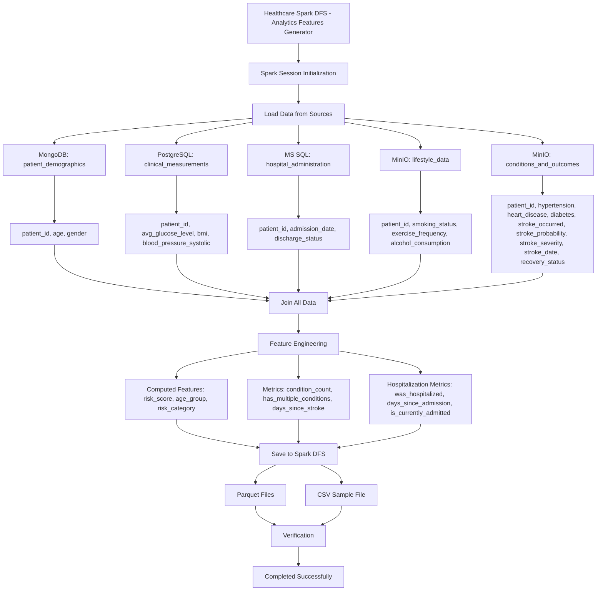
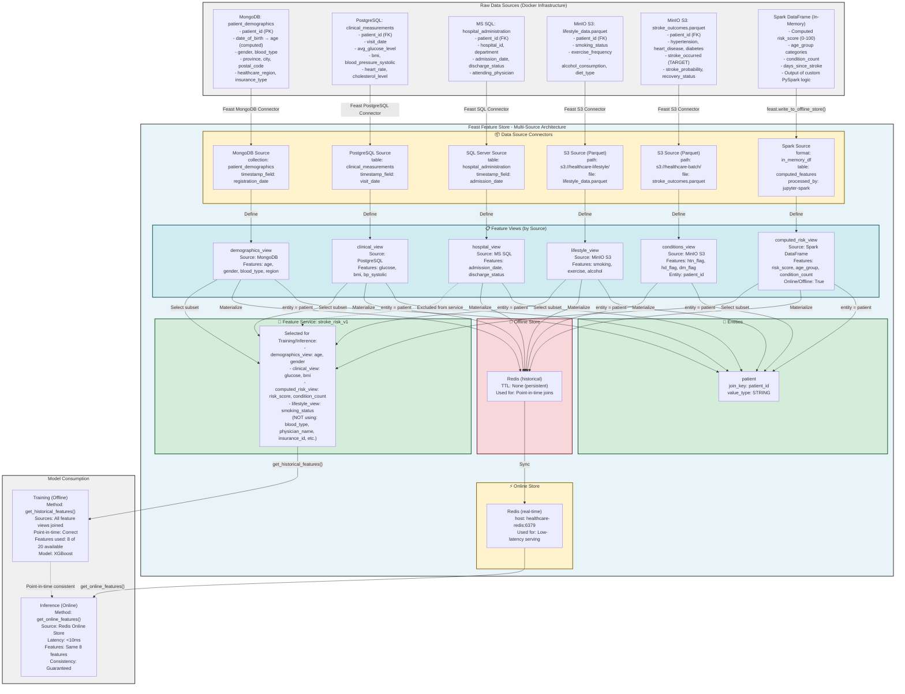

# Spark

```mermaid
graph TD
    A[Healthcare Spark DFS - Analytics Features Generator] --> B[Spark Session Initialization]
    B --> C[Load Data from Sources]
    C --> D[MongoDB: patient_demographics]
    C --> E[PostgreSQL: clinical_measurements]
    C --> F[MS SQL: hospital_administration]
    C --> G[MinIO: lifestyle_data]
    C --> H[MinIO: conditions_and_outcomes]
    
    D --> I[patient_id, age, gender]
    E --> J[patient_id, avg_glucose_level, bmi, blood_pressure_systolic]
    F --> K[patient_id, admission_date, discharge_status]
    G --> L[patient_id, smoking_status, exercise_frequency, alcohol_consumption]
    H --> M[patient_id, hypertension, heart_disease, diabetes, stroke_occurred, stroke_probability, stroke_severity, stroke_date, recovery_status]
    
    I --> N[Join All Data]
    J --> N
    K --> N
    L --> N
    M --> N
    
    N --> O[Feature Engineering]
    O --> P[Computed Features: risk_score, age_group, risk_category]
    O --> Q[Metrics: condition_count, has_multiple_conditions, days_since_stroke]
    O --> R[Hospitalization Metrics: was_hospitalized, days_since_admission, is_currently_admitted]
    
    P --> S[Save to Spark DFS]
    Q --> S
    R --> S
    
    S --> T[Parquet Files]
    S --> U[CSV Sample File]
    
    T --> V[Verification]
    U --> V
    
    V --> W[Completed Successfully]
```

# Feast

```mermaid
graph TB
    %% DATA SOURCES - Multiple heterogeneous sources
    subgraph DataSources ["Raw Data Sources (Docker Infrastructure)"]
        direction TB
        
        MongoDB["MongoDB: patient_demographics
        - patient_id (PK)
        - date_of_birth → age (computed)
        - gender, blood_type
        - province, city, postal_code
        - healthcare_region, insurance_type"]
        
        PostgreSQL["PostgreSQL: clinical_measurements
        - patient_id (FK)
        - visit_date
        - avg_glucose_level
        - bmi, blood_pressure_systolic
        - heart_rate, cholesterol_level"]
        
        MSSQL["MS SQL: hospital_administration
        - patient_id (FK)
        - hospital_id, department
        - admission_date, discharge_status
        - attending_physician"]
        
        MinioLifestyle["MinIO S3: lifestyle_data.parquet
        - patient_id (FK)
        - smoking_status
        - exercise_frequency
        - alcohol_consumption, diet_type"]
        
        MinioBatch["MinIO S3: stroke_outcomes.parquet
        - patient_id (FK)
        - hypertension, heart_disease, diabetes
        - stroke_occurred (TARGET)
        - stroke_probability, recovery_status"]
        
        SparkDF["Spark DataFrame (In-Memory)
        - Computed risk_score (0-100)
        - age_group categories
        - condition_count
        - days_since_stroke
        - Output of custom PySpark logic"]
    end
    
    %% FEAST FEATURE STORE - Central Hub connecting to all sources
    subgraph FeastCore ["Feast Feature Store - Multi-Source Architecture"]
        direction TB
        
        subgraph Sources ["📦 Data Source Connectors"]
            MongoSource["MongoDB Source
            collection: patient_demographics
            timestamp_field: registration_date"]
            
            PostgresSource["PostgreSQL Source
            table: clinical_measurements
            timestamp_field: visit_date"]
            
            MSSQLSource["SQL Server Source
            table: hospital_administration
            timestamp_field: admission_date"]
            
            MinioSource1["S3 Source (Parquet)
            path: s3://healthcare-lifestyle/
            file: lifestyle_data.parquet"]
            
            MinioSource2["S3 Source (Parquet)
            path: s3://healthcare-batch/
            file: stroke_outcomes.parquet"]
            
            SparkSource["Spark Source
            format: in_memory_df
            table: computed_features
            processed_by: jupyter-spark"]
        end
        
        subgraph Entities ["👤 Entities"]
            PatientEntity["patient
            join_key: patient_id
            value_type: STRING"]
        end
        
        subgraph FeatureViews ["📋 Feature Views (by Source)"]
            DemoView["demographics_view
            Source: MongoDB
            Features: age, gender, blood_type, region"]
            
            ClinicalView["clinical_view
            Source: PostgreSQL
            Features: glucose, bmi, bp_systolic"]
            
            HospitalView["hospital_view
            Source: MS SQL
            Features: admission_date, discharge_status"]
            
            LifestyleView["lifestyle_view
            Source: MinIO S3
            Features: smoking, exercise, alcohol"]
            
            ConditionView["conditions_view
            Source: MinIO S3
            Features: htn_flag, hd_flag, dm_flag
            Entity: patient_id"]
            
            ComputedView["computed_risk_view
            Source: Spark DataFrame
            Features: risk_score, age_group, condition_count
            Online/Offline: True"]
        end
        
        subgraph OfflineStore ["💾 Offline Store"]
            OfflineRedis["Redis (historical)
            TTL: None (persistent)
            Used for: Point-in-time joins"]
        end
        
        subgraph OnlineStore ["⚡ Online Store"]
            OnlineRedis["Redis (real-time)
            host: healthcare-redis:6379
            Used for: Low-latency serving"]
        end
        
        subgraph FeatureService ["🎯 Feature Service: stroke_risk_v1"]
            SelectedFeatures["Selected for Training/Inference:
            - demographics_view: age, gender
            - clinical_view: glucose, bmi
            - computed_risk_view: risk_score, condition_count
            - lifestyle_view: smoking_status
            (NOT using: blood_type, physician_name, insurance_id, etc.)"]
        end
    end
    
    %% CONSUMPTION - Training and Inference
    subgraph Consumption ["Model Consumption"]
        direction TB
        
        Training["Training (Offline)
        Method: get_historical_features()
        Sources: All feature views joined
        Point-in-time: Correct
        Features used: 8 of 20 available
        Model: XGBoost"]
        
        Inference["Inference (Online)
        Method: get_online_features()
        Source: Redis Online Store
        Latency: <10ms
        Features: Same 8 features
        Consistency: Guaranteed"]
    end
    
    %% CONNECTIONS - Feast connects to ALL sources directly
    MongoDB -->|"Feast MongoDB Connector"| MongoSource
    PostgreSQL -->|"Feast PostgreSQL Connector"| PostgresSource
    MSSQL -->|"Feast SQL Connector"| MSSQLSource
    MinioLifestyle -->|"Feast S3 Connector"| MinioSource1
    MinioBatch -->|"Feast S3 Connector"| MinioSource2
    SparkDF -->|" feast.write_to_offline_store()"| SparkSource
    
    MongoSource -->|"Define"| DemoView
    PostgresSource -->|"Define"| ClinicalView
    MSSQLSource -->|"Define"| HospitalView
    MinioSource1 -->|"Define"| LifestyleView
    MinioSource2 -->|"Define"| ConditionView
    SparkSource -->|"Define"| ComputedView
    
    DemoView -->|"entity = patient"| PatientEntity
    ClinicalView -->|"entity = patient"| PatientEntity
    HospitalView -->|"entity = patient"| PatientEntity
    LifestyleView -->|"entity = patient"| PatientEntity
    ConditionView -->|"entity = patient"| PatientEntity
    ComputedView -->|"entity = patient"| PatientEntity
    
    DemoView -->|"Materialize"| OfflineRedis
    ClinicalView -->|"Materialize"| OfflineRedis
    HospitalView -->|"Materialize"| OfflineRedis
    LifestyleView -->|"Materialize"| OfflineRedis
    ConditionView -->|"Materialize"| OfflineRedis
    ComputedView -->|"Materialize"| OfflineRedis
    
    OfflineRedis -->|"Sync"| OnlineRedis
    
    DemoView -->|"Select subset"| SelectedFeatures
    ClinicalView -->|"Select subset"| SelectedFeatures
    LifestyleView -->|"Select subset"| SelectedFeatures
    ComputedView -->|"Select subset"| SelectedFeatures
    HospitalView -.->|"Excluded from service"| SelectedFeatures
    
    SelectedFeatures -->|"get_historical_features()"| Training
    OnlineRedis -->|"get_online_features()"| Inference
    
    Training -.->|"Point-in-time consistent"| Inference
    
    %% Styling - clean and simple
    style DataSources fill:#f0f0f0,stroke:#333,stroke-width:2px
    style FeastCore fill:#e8f4f8,stroke:#333,stroke-width:2px
    style Sources fill:#fff3cd,stroke:#856404,stroke-width:2px
    style Entities fill:#d4edda,stroke:#155724,stroke-width:2px
    style FeatureViews fill:#d1ecf1,stroke:#0c5460,stroke-width:2px
    style OfflineStore fill:#f8d7da,stroke:#721c24,stroke-width:2px
    style OnlineStore fill:#fff3cd,stroke:#856404,stroke-width:2px
    style FeatureService fill:#d4edda,stroke:#155724,stroke-width:2px
    style Consumption fill:#f0f0f0,stroke:#333,stroke-width:2px
```